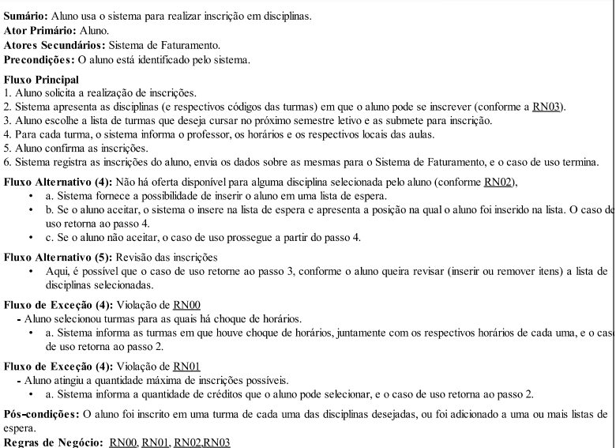
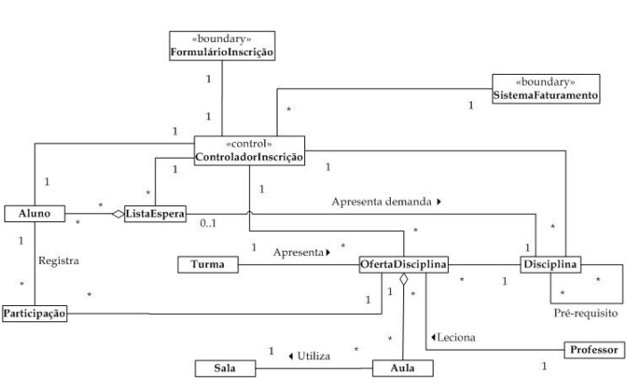

# Caso de uso realizar inscrição:






# Como rodar a aplicação
``` 
python -m venv .venv
```
``` 
.\.venv\Scripts\activate
```
```
pip install -r requirements.txt 
```
```
python manage.py migrate
```
```
python manage.py runserver
```

O servidor vai rodar neste [link](http://127.0.0.1:8000/).

# Comandos uteis

1. Faz um backup dos dados a aplicação no arquivo 0001_DevData.json.
```
    python -Xutf8 manage.py dumpdata core --indent 4 -o core/seed/0001_DevData.json
```

<br>

2. Faz a restauração dos dados a partir do arquivo "0001_DevData.json".
```
    python -Xutf8 manage.py loaddata core/seed/0001_DevData.json
```

<br>

3. Cria um super usuário para acessar o /admin.
```
    python manage.py createsuperuser  
```